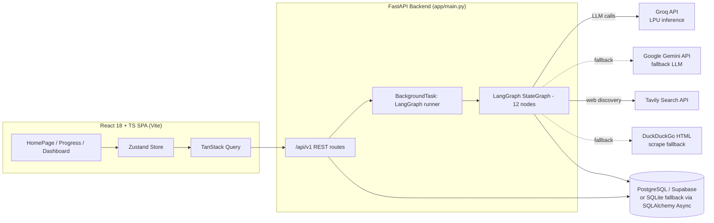
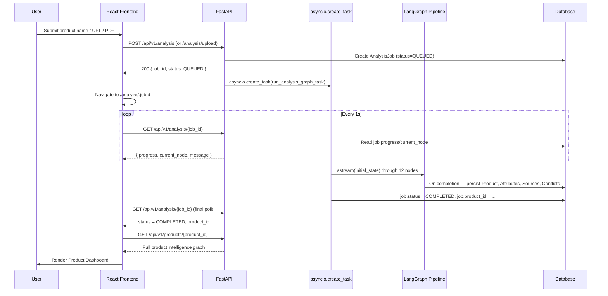
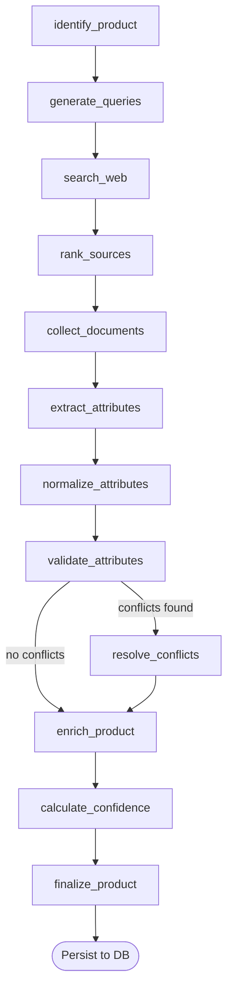
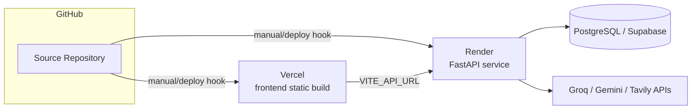
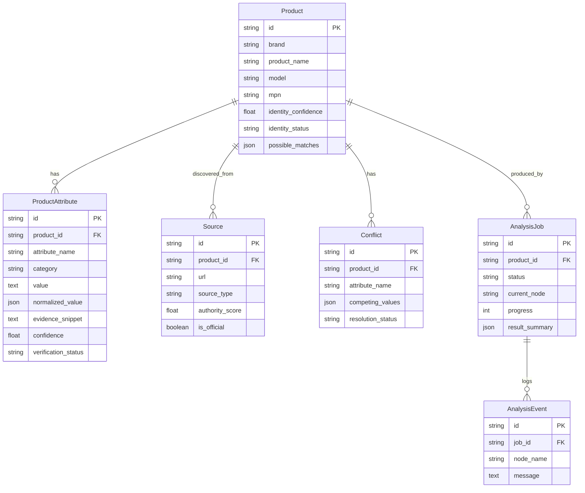

# UniSpecs

### AI-Powered Verified Product Intelligence Platform

> Turns a product name, URL, or PDF datasheet into a structured, evidence-backed specification sheet — every value traceable to a source, every conflict shown, every confidence score explained.

[](https://unispecs.vercel.app)
[](https://unispecs.onrender.com)
[](https://unispecs.onrender.com/docs)


**Team NexAura** — [Neelkamal](https://github.com/Neelkamal-dev) · [Lakshay Porwal](https://github.com/lakshay-porwal)

- **Live Web App:** https://unispecs.vercel.app
- **Live Backend API:** https://unispecs.onrender.com
- **Interactive Swagger Docs:** https://unispecs.onrender.com/docs

---

## Table of Contents

- [Overview](#overview)
- [Why It Exists](#why-it-exists)
- [Architecture](#architecture)
- [Technology Stack](#technology-stack)
- [The LangGraph Pipeline](#the-langgraph-pipeline)
- [Feature Deep Dive](#feature-deep-dive)
- [Project Structure](#project-structure)
- [Database Design](#database-design)
- [API Documentation](#api-documentation)
- [Environment Variables](#environment-variables)
- [Getting Started](#getting-started)
- [Docker](#docker)
- [Testing](#testing)
- [Security](#security)
- [Error Handling](#error-handling)
- [Performance & Scalability Notes](#performance--scalability-notes)
- [Roadmap](#roadmap)
- [Troubleshooting](#troubleshooting)
- [License](#license)

---

## Overview

**UniSpecs** takes a fragmented, unreliable product-research problem — "what are the *real* specs of this product, and can I trust them?" — and turns it into a repeatable pipeline: identify the exact product, discover authoritative sources, extract specifications with preserved evidence, normalize units, cross-validate across sources, resolve conflicts using source-authority heuristics, and output a confidence-scored, exportable specification sheet.

It is not a chatbot wrapper. There is no open-ended chat interface anywhere in the app — the only user-facing actions are: submit a product query (name/model, URL, or PDF), watch a 12-step LangGraph pipeline execute in real time, and browse the resulting product dashboard (specifications, sources, validation/conflicts, evidence, exports).

**Who it's for:** developers, researchers, and shoppers who need to compare technical specifications (phones, tools, electronics, etc.) without manually cross-referencing five different retailer pages and a PDF datasheet — and reviewers/recruiters who want to see a non-trivial, multi-stage async AI pipeline implemented end-to-end.

## Why It Exists

Manufacturer pages, retailer listings, and third-party spec databases frequently disagree with each other, and none of them tell you *why* you should trust one number over another. UniSpecs' core engineering bet is that a specification is only useful if it comes with:

1. **A source** (who said this, and how authoritative are they),
2. **Evidence** (the exact sentence/quote it was extracted from), and
3. **A confidence score with a written justification**, not just a number.

Everything downstream in the architecture — the authority-scoring table in `core/config.py`, the `evidence_snippet` field on every attribute, the `Conflict` model, the `ConfidenceEngine` — exists to serve that one guarantee.

---

## Architecture

UniSpecs is a **client-server, full-stack application** consisting of a React SPA and a single FastAPI service that runs an async **LangGraph** state-machine pipeline as a background task. It is not a microservices system and does not use message queues, WebSockets, or a vector database in the current implementation — analysis progress is delivered via **1-second HTTP polling**, and there is no LLM-memory / conversational-chat layer.

### High-Level System Architecture



### Request / Analysis Lifecycle



### AI Pipeline Architecture (LangGraph)



Each node mutates a single shared `ProductState` TypedDict (`app/ai/graph/state.py`) and reports `progress` (0–100) and a `status_message`, which the background task writes back to the `AnalysisJob` row after every node — this is what powers the live progress bar on `/analyze/:jobId`.

### Deployment Architecture




---

## Technology Stack

### Backend

| Technology | Role |
|---|---|
| **Python 3.13**, **FastAPI** | Async REST API, OpenAPI/Swagger docs at `/docs` |
| **Pydantic v2** / **pydantic-settings** | Request/response schemas (`app/schemas/product.py`) and typed settings (`app/core/config.py`) |
| **LangGraph** (`StateGraph`) | Orchestrates the 12-node analysis pipeline with conditional branching |
| **SQLAlchemy 2.0 (async)** | ORM — `AsyncSession`, `create_async_engine` |
| **asyncpg** / **aiosqlite** | Async DB drivers for PostgreSQL and the SQLite fallback |
| **PyMuPDF (`fitz`)** | Native-text-layer PDF parsing, page-by-page |
| **BeautifulSoup4** | HTML parsing/cleaning for fetched web pages |
| **httpx** | Async HTTP client used for Groq, Gemini-adjacent fetches, Tavily, DuckDuckGo scraping, and SSRF-checked URL fetches |
| **pandas**, **openpyxl** | CSV and multi-tab styled Excel export generation |
| **pytest**, **pytest-asyncio** | Unit and one true end-to-end integration test |

### AI / LLM Integration

| Component | Implementation |
|---|---|
| **Primary LLM** | **Groq API** (`groq/compound`-family model configured via `GROQ_MODEL`, called directly over `httpx` against `api.groq.com`), tried first for identification, extraction, and commerce-copy generation |
| **Fallback LLM** | **Google Gemini** via the official `google-genai` SDK (`gemini-2.5-flash` → `gemini-2.0-flash` → `gemini-1.5-flash`), used only if Groq is unconfigured or fails |
| **Orchestration** | **LangGraph** `StateGraph` — a genuine 12-node graph with one conditional edge (`resolve_conflicts` only runs if conflicts were detected) |
| **No-key fallback** | If neither `GROQ_API_KEY` nor `GEMINI_API_KEY` is set, `LLMService` falls back to deterministic, regex-based product identification and a dual-strategy local text/table + universal-unit-token specification extractor — the app still functions without any LLM key, just with lower-quality extraction |
| **Anti-hallucination policy** | Every LLM prompt for extraction explicitly instructs "NEVER invent missing values... return NULL for missing fields" and requires a verbatim `evidence_snippet` per attribute |


### Search / Web Discovery

| Technology | Role |
|---|---|
| **Tavily Search API** | Primary web search provider (`TavilySearchProvider`) when `TAVILY_API_KEY` is set |
| **DuckDuckGo HTML scrape (`html.duckduckgo.com`)** | Fallback search provider (`FallbackSearchProvider`) used when no Tavily key is configured, scraped via `httpx` + BeautifulSoup |
| **Templated last-resort fallback** | If the DuckDuckGo scrape itself returns nothing, `FallbackSearchProvider` returns two synthetic, clearly-templated "sample datasheet" results (generic 8GB/256GB/4000mAh-style placeholder specs) so the pipeline can still complete end-to-end in a fully offline/keyless demo mode — this is a documented fallback behavior, not hidden hallucination, but real product accuracy in this mode is limited |

### Frontend

| Technology | Role |
|---|---|
| **React 18** + **TypeScript** (strict) | UI layer — note: `package.json` pins React `^18.2.0`, not React 19 |
| **Vite 5** | Dev server and build tool |
| **Tailwind CSS 3** | Styling (utility classes, custom `brand`/`canvas`/`surface` design tokens) |
| **TanStack Query (React Query) v5** | Server-state fetching/caching (analysis polling, product fetch) |
| **Zustand** | Client UI state — active product, drawer open/closed, active dashboard tab, filters |
| **React Router DOM v6** | Client-side routing (`/`, `/analyze/:jobId`, `/products/:productId`) |
| **Axios** | HTTP client (`services/api.ts`) |
| **lucide-react** | Icon set |

### Database

| Technology | Role |
|---|---|
| **PostgreSQL** (via `docker-compose.yml`, using the `pgvector/pgvector:pg16` image) or **Supabase** | Production/primary datastore when `DATABASE_URL` is set |
| **SQLite (`aiosqlite`)** | Zero-config local fallback at `./data/unispecs.db`, created automatically if `DATABASE_URL` is empty, and also used automatically if the primary DB connection fails at startup (`init_db()` catches the exception and re-points the engine at SQLite) |


---

## The LangGraph Pipeline

`backend/app/ai/graph/graph.py` builds and compiles the following graph via `create_unispecs_graph()`:

| # | Node | What it actually does |
|---|---|---|
| 1 | `identify_product` | Calls `LLMService.identify_product()` (Agent 1) to resolve brand/model/MPN/category and an `identity_confidence`; falls back to heuristic parsing (first capitalized word = brand, first alphanumeric token with a digit = model) if no LLM key is set |
| 2 | `generate_queries` | Builds 4 templated search queries ("official specifications", "technical datasheet pdf", "manual user guide", "hardware details battery ram display") |
| 3 | `search_web` | Runs all 4 queries concurrently via `asyncio.gather` against the active `WebSearchProvider` |
| 4 | `rank_sources` | Sorts discovered sources descending by `authority_score` |
| 5 | `collect_documents` | Assembles the document set: the user's uploaded PDF (SSRF-safe fetch if a URL was given), user-pasted text, and the top 5 ranked web sources |
| 6 | `extract_attributes` | Calls `LLMService.extract_attributes_from_document()` (Agent 2) per document (per-page in parallel for multi-page PDFs), with a non-LLM regex/table-parsing fallback |
| 7 | `normalize_attributes` | Runs every extracted value through `NormalizationEngine` (unit conversion) |
| 8 | `validate_attributes` | `ValidationEngine.perform_cross_source_validation()` groups same-named attributes across sources and either confirms a consensus value or raises a `Conflict` |
| 9 | `resolve_conflicts` *(conditional)* | Only runs if step 8 produced conflicts; `ConflictResolver` scores competing values by summed source authority (+0.30 bonus for manufacturer-class sources) and resolves automatically only if the score lead is ≥ 0.30 and manufacturer-backed — otherwise flags `NEEDS_HUMAN_REVIEW` |
| 10 | `enrich_product` | Checks for six expected "core" specs (battery, RAM, storage, weight, dimensions, water/dust resistance); for any missing, fires a targeted follow-up web search + extraction; also generates optional marketing/commerce copy, kept separate from verified specs |
| 11 | `calculate_confidence` | `ConfidenceEngine.calculate_product_overall_metrics()` computes `verification_rate`, `data_completeness` (against an expected core count of 10), and counts |
| 12 | `finalize_product` | Assembles the final in-memory product graph; the calling background task then persists `Product`, `ProductAttribute`, `Source`, and `Conflict` rows |

---

## Feature Deep Dive

### Multi-Input Analysis (text / URL / PDF)
**Purpose:** let a user start from whatever they already have — a product name, a manufacturer link, or a downloaded datasheet.
**Implementation:** `InputModeDropdown.tsx` toggles between three modes on `HomePage.tsx`; text/URL requests hit `POST /api/v1/analysis`, PDF uploads hit `POST /api/v1/analysis/upload` (`.pdf` only, saved to `UPLOAD_DIR` with a UUID-prefixed filename).
**Data flow:** frontend form → `AnalysisRequest`/`multipart/form-data` → `AnalysisJob` row created → LangGraph pipeline scheduled as a background `asyncio` task.

### Real-Time-Feeling Progress (polling, not sockets)
**Purpose:** show the user which pipeline stage is running.
**Implementation:** `AnalysisProgressPage.tsx` polls `GET /api/v1/analysis/{job_id}` once per second via TanStack Query; each LangGraph node updates `AnalysisJob.progress`/`current_node`/`message` in the DB as it completes.
**Note:** the old project README referenced SSE/WebSockets as a stretch goal — the shipped implementation is HTTP polling only; there is no WebSocket server in this codebase.

### SSRF-Protected URL Fetching
**Purpose:** allow analyzing an arbitrary manufacturer URL without exposing the server to internal-network requests.
**Implementation:** `DocumentParser.is_safe_url()` resolves the hostname and rejects private, loopback, link-local, multicast, or reserved IP ranges before any fetch occurs (`document_parser.py`).

### Cross-Source Validation & Conflict Resolution
**Purpose:** never silently pick a number — either confirm it across sources or say explicitly that it's disputed.
**Implementation:** `ValidationEngine` (Layer 2) groups attributes by name across all extracted sources; a single normalized value across sources becomes `VERIFIED` with a confidence formula `min(0.99, 0.70 + 0.10×agree_count + 0.15×highest_authority)`; multiple distinct values become a `Conflict` row with all `competing_values` preserved. `ConflictResolver` then attempts automatic resolution using an authority-score-lead heuristic, or explicitly flags `NEEDS_HUMAN_REVIEW`.
**Relevant files:** `services/validation.py`, `services/conflict_resolver.py`.

### Technical Unit Normalization
**Purpose:** make "8GB", "8 gigabytes", and "8,192 MB" comparable.
**Implementation:** `NormalizationEngine` (`services/normalization.py`) handles digital storage, battery (mAh/Wh/Ah), weight (g/kg/oz/lb), physical dimensions, current, voltage, power, and frequency — each producing a `{value, unit}` pair plus a generic numeric fallback for anything else.

### Evidence Preservation & Explainable Confidence
**Purpose:** every number should be traceable and every confidence score explainable in plain English, not just a float.
**Implementation:** `ProductAttribute.evidence_snippet` stores the literal supporting text; `ConfidenceEngine` builds a human-readable `confidence_reason` string (e.g. *"Supported by official manufacturer documentation. Confirmed across 2 independent sources. Direct textual evidence quote preserved."*) alongside the numeric score. The frontend surfaces this via `AttributeDetailDrawer.tsx`.

### Structured Export (JSON / CSV / Excel)
**Purpose:** let the verified data leave the platform in a usable format.
**Implementation:** `ExportService` (`services/export_service.py`, 570 lines) builds a 6-tab styled Excel workbook (Complete Datasheet, Executive Overview, Flat Specification Table, Sources, Validation & Conflicts, Commerce Highlights) via `openpyxl`, plus flat CSV via `pandas` and raw JSON. Served through `GET /api/v1/products/{id}/export?format=json|csv|excel` with a `Content-Disposition` attachment header.

---

## Project Structure

```text
unispecs/
├── backend/
│   ├── app/
│   │   ├── ai/graph/
│   │   │   ├── state.py            # ProductState TypedDict — the single shared pipeline state
│   │   │   └── graph.py            # All 12 LangGraph node functions + StateGraph wiring
│   │   ├── api/routes/
│   │   │   ├── health.py           # GET /health — provider key configuration status
│   │   │   ├── analysis.py         # POST /analysis, /analysis/upload; GET /analysis/{id}, /analysis/history
│   │   │   └── products.py         # GET /products, /products/{id}, /attributes, /sources, /validation, /evidence, /export
│   │   ├── core/
│   │   │   └── config.py           # pydantic-settings; AUTHORITY_SCORES heuristic table
│   │   ├── db/
│   │   │   ├── models.py           # SQLAlchemy models: Product, ProductAttribute, Source, SourceDocument, Conflict, AnalysisJob, AnalysisEvent
│   │   │   └── session.py          # Async engine w/ automatic Postgres→SQLite fallback
│   │   ├── schemas/
│   │   │   └── product.py          # Pydantic request/response schemas + APIResponse/APIErrorResponse envelopes
│   │   ├── services/
│   │   │   ├── llm_service.py      # Groq-first/Gemini-fallback LLM calls + non-LLM heuristic fallback
│   │   │   ├── search_provider.py  # Tavily / DuckDuckGo-scrape / templated last-resort providers
│   │   │   ├── document_parser.py  # PDF (PyMuPDF) + HTML (BeautifulSoup) parsing, SSRF-safe URL fetch
│   │   │   ├── normalization.py    # Unit normalization engine
│   │   │   ├── validation.py       # Rule-based + cross-source validation
│   │   │   ├── conflict_resolver.py# Authority-weighted conflict resolution
│   │   │   ├── confidence.py       # Explainable confidence scoring
│   │   │   └── export_service.py   # JSON / CSV / multi-tab Excel export
│   │   └── main.py                 # FastAPI app, CORS, global exception handler, router registration
│   ├── tests/                      # pytest — normalization, validation, SSRF/domain classification, full E2E
│   ├── requirements.txt
│   └── .env.example
│
├── frontend/
│   ├── src/
│   │   ├── components/
│   │   │   ├── Header.tsx              # Nav + live backend health indicator
│   │   │   ├── InputModeDropdown.tsx   # text / link / document mode switcher
│   │   │   └── AttributeDetailDrawer.tsx # Per-attribute evidence & source detail panel
│   │   ├── pages/
│   │   │   ├── HomePage.tsx            # Landing + multi-mode input form
│   │   │   ├── AnalysisProgressPage.tsx# Polls job status, shows live node progress
│   │   │   └── ProductDashboardPage.tsx# Tabs: overview / specifications / sources / validation / evidence / export
│   │   ├── services/api.ts             # Centralized Axios client for /api/v1
│   │   ├── store/useAnalysisStore.ts   # Zustand: active product, drawer, tab, filters
│   │   └── types/index.ts              # Shared TypeScript interfaces mirroring backend Pydantic schemas
│   ├── package.json
│   ├── vite.config.ts
│   ├── tailwind.config.js
│   └── vercel.json                     # SPA rewrite rule for client-side routing
│
├── docker-compose.yml       # postgres (pgvector image) + backend + frontend services
├── .gitignore
└── README.md
```

*(The nested `ai/graph/nodes/` package sometimes referenced in project docs does not exist as a separate directory — all 12 node functions live directly in `app/ai/graph/graph.py`.)*

---

## Database Design

Schema is defined with plain **SQLAlchemy 2.0 async ORM models** (`backend/app/db/models.py`) — there is no separate migration tool (no Alembic directory present); tables are created automatically at startup via `Base.metadata.create_all()` in `init_db()`.

<details>
<summary><b>Entity-Relationship Diagram</b></summary>



</details>

| Model | Purpose |
|---|---|
| **Product** | The resolved product identity — brand, name, model, MPN, category, `identity_confidence`/`identity_status`, and any `possible_matches` when identification was ambiguous. |
| **ProductAttribute** | One verified (or conflicted/enriched) specification: raw + normalized value, unit, category, source attribution, evidence snippet, page/section, confidence + reason, verification status. |
| **Source** | A ranked, classified web/document source with its `source_type` (e.g. `MANUFACTURER_PAGE`) and `authority_score`. |
| **SourceDocument** | Defined in the model file for raw parsed-document storage, but is **not currently written to** anywhere in `graph.py` or `analysis.py` — effectively unused at present. |
| **Conflict** | A detected disagreement between sources for one attribute, its competing values, and its resolution outcome/reason. |
| **AnalysisJob** | Tracks one analysis run's status, current pipeline node, progress percentage, and final `result_summary` (the confidence metrics). |
| **AnalysisEvent** | Defined in the model for a per-node event log, but is **not currently populated** anywhere in the codebase — progress is tracked only via `AnalysisJob` fields, not `AnalysisEvent` rows. |

> **Documentation note:** `SourceDocument` and `AnalysisEvent` are fully defined SQLAlchemy models with no corresponding `INSERT`/`db.add()` call anywhere in the current backend code — they represent either planned-but-unfinished features or dead schema.

---

## API Documentation

All endpoints are prefixed with `/api/v1`. Every successful response is wrapped as `{ "data": ..., "meta": {...} }` (`APIResponse`); unhandled exceptions return a structured `{ "error": { "code", "message", "details" } }` body with HTTP 500.

<details>
<summary><b>Health</b></summary>

| Method | Endpoint | Description |
|---|---|---|
| GET | `/health` | Service status, environment, and whether Gemini/Tavily keys are configured (does not report Groq key status) |

</details>

<details>
<summary><b>Analysis</b></summary>

| Method | Endpoint | Description |
|---|---|---|
| POST | `/analysis` | Start an analysis job from `product_name` / `model` / `mpn` / `url` / `text` |
| POST | `/analysis/upload` | Start an analysis job from an uploaded `.pdf` (multipart form, optional `product_name`/`model`) |
| GET | `/analysis/{job_id}` | Poll job status, current node, progress %, message, error, and result summary |
| GET | `/analysis/history` | Last 20 analysis jobs, most recent first |

</details>

<details>
<summary><b>Products</b></summary>

| Method | Endpoint | Description |
|---|---|---|
| GET | `/products?search=&limit=&offset=` | List products with optional search across brand/name/model/MPN/category, paginated |
| GET | `/products/{product_id}` | Full product graph: identity, attributes, sources, conflicts |
| GET | `/products/{product_id}/attributes` | Just the attribute list |
| GET | `/products/{product_id}/sources` | Just the discovered/ranked sources |
| GET | `/products/{product_id}/validation` | Validation score, verified/conflict/needs-review counts, full conflict list |
| GET | `/products/{product_id}/evidence` | Attributes that carry an evidence snippet or source URL |
| GET | `/products/{product_id}/export?format=json\|csv\|excel` | Download the product data as a file |

</details>

> **Note:** the frontend (`services/api.ts`) does not call `GET /products` (the list/search endpoint) — the SPA only ever navigates directly to a specific `/products/:productId` reached via the analysis flow. The list endpoint exists and works but currently has no UI consumer.

---

## Environment Variables

**Backend (`backend/.env`, see `backend/.env.example`)**

| Variable | Purpose | Required |
|---|---|---|
| `HOST` | Bind address for uvicorn | No (default `0.0.0.0`) |
| `PORT` | Bind port | No (default `8000`) |
| `ENVIRONMENT` | `development` / `production` label | No |
| `CORS_ORIGINS` | Allowed CORS origins | No (has hardcoded defaults in `config.py`) |
| `DATABASE_URL` | PostgreSQL/Supabase connection string; if empty, SQLite is used automatically | No |
| `SUPABASE_URL` / `SUPABASE_SERVICE_ROLE_KEY` | Present in config for Supabase-based deployments | No |
| `GEMINI_API_KEY` | Fallback LLM provider | No — app runs in reduced-quality heuristic mode without it |
| `GROQ_API_KEY` | Primary LLM provider | No — see above |
| `GROQ_MODEL` | Groq model name (defaults to `openai/gpt-oss-120b` in code) | No |
| `TAVILY_API_KEY` | Primary web search provider | No — falls back to DuckDuckGo scraping |
| `UPLOAD_DIR` | Where uploaded PDFs are stored | No (default `./uploads`) |
| `MAX_UPLOAD_SIZE_MB` | Declared upload size limit | No (default `25`; **not currently enforced** by any code path — see Security) |

**Frontend (`frontend/.env`, see `frontend/.env.example`)**

| Variable | Purpose | Required |
|---|---|---|
| `VITE_API_URL` | Base URL of the backend API | Yes (defaults to `http://localhost:8000` if unset) |


---

## Getting Started

### Prerequisites
- **Python 3.10+** (developed/tested on 3.13)
- **Node.js 18+** and npm

### 1. Configure environment

```bash
# Linux/macOS
cp backend/.env.example backend/.env
cp frontend/.env.example frontend/.env

# Windows PowerShell
copy backend\.env.example backend\.env
copy frontend\.env.example frontend\.env
```

Add real values for `GEMINI_API_KEY`, `GROQ_API_KEY`, and/or `TAVILY_API_KEY` in `backend/.env` for full-quality results. If left blank, the backend runs in fallback mode (heuristic identification/extraction, DuckDuckGo-scraped or templated search results) rather than failing.

### 2. Start the backend

```bash
cd backend
python -m venv venv

# Windows PowerShell
.\venv\Scripts\Activate.ps1
# Linux / macOS
source venv/bin/activate

pip install -r requirements.txt
uvicorn app.main:app --reload --host 0.0.0.0 --port 8000
```

- API: `http://localhost:8000`
- Swagger UI: `http://localhost:8000/docs`
- Health check: `http://localhost:8000/api/v1/health`

### 3. Start the frontend

```bash
cd frontend
npm install
npm run dev
```

- App: `http://localhost:5173`

### 4. Database

No manual setup required for local development — leave `DATABASE_URL` empty in `backend/.env` and the backend will create `./data/unispecs.db` (SQLite) automatically on first run. To use PostgreSQL/Supabase instead, set `DATABASE_URL` to a `postgresql://` connection string (the app rewrites it to `postgresql+asyncpg://` automatically); tables are created on startup, there is no separate migration step to run.

---

## Docker

`docker-compose.yml` at the repository root defines three services: `postgres` (image `pgvector/pgvector:pg16`), `backend` (built from `./backend`), and `frontend` (built from `./frontend`), wired together with `DATABASE_URL` pointing at the `postgres` service and `VITE_API_URL` pointing at the backend.

```bash
docker-compose up --build
```


## Testing

**Framework:** `pytest` + `pytest-asyncio`. Run from `backend/`:

```bash
pytest -v
```

| File | Coverage |
|---|---|
| `test_normalization.py` | Unit tests for RAM/storage, battery, weight, and dimension unit normalization |
| `test_validation.py` | Rule-based validation (rejects negative/invalid values) and cross-source validation (agreement → `VERIFIED`, disagreement → `Conflict`) |
| `test_enhancements.py` | SSRF URL-safety checks (rejects loopback/private/link-local IPs) and brand-aware domain classification/authority scoring |
| `test_e2e_example.py` | Full integration test — creates a real analysis job for "Samsung Galaxy S24 / SM-S921B" against the live app, polls to completion, and asserts on the persisted product, attributes, sources, validation, evidence, and all three export formats |

> **No coverage percentage is reported anywhere in this repository** — no coverage tool (`pytest-cov`, `coverage.py`) is configured. Do not assume a specific coverage number; none is verifiable from the source.
> The E2E test makes real network/LLM calls in fallback or live mode and depends on external services (Groq/Gemini/Tavily/DuckDuckGo) being reachable — it is closer to a live smoke test than an isolated integration test.

---

## Security

**Currently implemented:**

| Measure | Implementation |
|---|---|
| **SSRF protection** | `DocumentParser.is_safe_url()` resolves the target hostname and rejects private, loopback, link-local, multicast, and reserved IP ranges before fetching any user-supplied URL |
| **File-type restriction on upload** | `/analysis/upload` rejects any filename not ending in `.pdf` |
| **Structured, generic error responses** | The global exception handler in `main.py` catches all unhandled exceptions and returns a consistent `APIErrorResponse` rather than leaking a raw traceback to the client (though it does include `str(exc)` in the `details` field of the JSON body, which is more verbose than a typical production error contract) |
| **PDF text-layer only parsing** | PyMuPDF extracts text directly; there is no execution of embedded PDF scripts/macros |
| **Secrets kept out of `.env.example`** | The example env files contain only placeholder values; real secrets are expected to live in a git-ignored `backend/.env` |

**Recommended improvements (not currently implemented):**

- **CORS is over-permissive.** `core/config.py` includes a literal `"*"` in the default `CORS_ORIGINS` list alongside `allow_credentials=True` — browsers will reject wildcard origins when credentials are allowed, but this default should be tightened to an explicit allowlist for production regardless.
- **No authentication or authorization anywhere.** Every endpoint, including PDF upload and all product data, is fully public. Any client can create unlimited analysis jobs, upload files, and read all stored product data. There is no user model, API key, or session mechanism in this codebase.
- **`MAX_UPLOAD_SIZE_MB` is declared but not enforced.** The setting exists in `config.py` but no code path in `analysis.py` checks the uploaded file's size before writing it to disk — a large file will be accepted and buffered into memory (`await file.read()`) without a size guard.
- **No rate limiting** on any endpoint, including the LLM-calling `/analysis` route, which could be used to exhaust API quotas or storage.
- **Uploaded file paths are predictable-ish and not cleaned up.** Files are written to `UPLOAD_DIR` with a UUID prefix (good) but are never deleted after analysis completes, and the directory has no size cap.

---

## Error Handling

- **Global handler:** `app.exception_handler(Exception)` in `main.py` catches anything unhandled and returns HTTP 500 with a structured `APIErrorResponse` body, and logs the full traceback server-side via `logger.error(..., exc_info=True)`.
- **Job-level failure tracking:** `run_analysis_graph_task` wraps the entire pipeline execution in a `try/except`; on failure it sets `AnalysisJob.status = "FAILED"` and stores the exception string in `error_message`, which the frontend can read via `GET /analysis/{job_id}`.
- **Per-provider resilience:** `LLMService` tries Groq first and falls back to Gemini on any exception; `get_search_provider()` falls back from Tavily → DuckDuckGo scrape → templated results rather than raising.
- **Database resilience:** `init_db()` catches a failed primary-database connection at startup and transparently re-points the engine at local SQLite instead of crashing the app.
- **Frontend:** TanStack Query's built-in `retry: 1` is configured globally in `App.tsx`; individual pages are not shown handling every error state in detail from the code reviewed (e.g. a failed `/analysis/{job_id}` poll's UI treatment was not exhaustively traced beyond the query configuration).

---

## Performance & Scalability Notes

**Currently implemented:**
- Search queries within a node (`search_web_node`) and document processing within `extract_attributes_node`/`enrich_product_node` run **concurrently via `asyncio.gather`**, not sequentially.
- Multi-page PDFs are extracted **per-page in parallel** rather than as one giant blob.
- `db.execute(...).scalars()`/`selectinload` is used for eager-loading relationships in `products.py`, avoiding N+1 queries when listing products with their attributes/sources/conflicts.

**Potential scalability improvements (not currently implemented):**
- Analysis jobs run as in-process `asyncio.create_task` background work tied to a single server process — there is no task queue (Celery/RQ/Arq) or worker pool, so this will not horizontally scale across multiple backend instances without additional work.
- No caching layer (e.g. Redis) exists for repeated identical product queries — the same product analyzed twice re-runs the full pipeline, including fresh LLM and search calls.
- No pagination on `/analysis/history` beyond a fixed `limit(20)`; no cursor-based pagination anywhere.
- The frontend polls every 1 second regardless of pipeline stage; there is no adaptive backoff or server-sent-events/WebSocket push, so polling load scales linearly with concurrent active jobs.


---

## Roadmap

### Completed
- 12-step LangGraph analysis pipeline with conditional conflict-resolution branching
- Multi-input analysis (product text/model, URL, PDF upload)
- SSRF-protected URL fetching
- Cross-source validation with authority-weighted automatic conflict resolution
- Technical unit normalization engine (storage, battery, weight, dimensions, current, voltage, power, frequency)
- Explainable, per-attribute confidence scoring
- JSON / CSV / multi-tab styled Excel export
- Groq-primary / Gemini-fallback / heuristic-fallback LLM layering so the app degrades gracefully without API keys
- Automatic PostgreSQL → SQLite fallback for zero-config local development
- Unit + one full end-to-end integration test suite


---

## Troubleshooting

| Symptom | Likely cause / fix |
|---|---|
| `docker-compose up --build` fails immediately | No `Dockerfile` exists in `backend/` or `frontend/` yet — see [Docker](#docker). Use the manual setup instead, or add Dockerfiles. |
| Backend starts but `/api/v1/health` shows both providers unconfigured | `GEMINI_API_KEY`/`GROQ_API_KEY`/`TAVILY_API_KEY` are empty in `backend/.env` — this is not fatal, but expect lower-quality, heuristic/templated results |
| Analysis job stays at `QUEUED` or never progresses | Confirm the backend process itself is still running — analysis executes as an in-process background `asyncio` task tied to that single server instance, not a separate worker |
| CORS errors in the browser console | Confirm `VITE_API_URL` in `frontend/.env` matches the backend's actual origin, and that origin is present in `CORS_ORIGINS` |
| `sqlite`-related errors on startup despite setting `DATABASE_URL` | Check the connection string is reachable; `init_db()` will silently fall back to SQLite on any Postgres connection failure, which can mask a misconfigured `DATABASE_URL` |
| PDF upload rejected with 400 | Only files with a `.pdf` extension are accepted by `/analysis/upload` |
| A fetched product URL fails with an SSRF-related error | This is expected/intentional if the URL resolves to a private, loopback, or link-local IP address — `DocumentParser.is_safe_url()` blocks these by design |

---

## License

Distributed under the **MIT License**. See `LICENSE` for more information.

---

## Authors

**Team NexAura**
- **Neelkamal** — [github.com/Neelkamal-dev](https://github.com/Neelkamal-dev)
- **Lakshay Porwal** — [github.com/lakshay-porwal](https://github.com/lakshay-porwal)

---

<div align="center">

If you found this project useful, consider giving it a ⭐ on GitHub.

</div>
